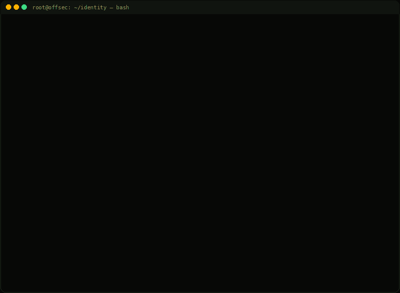

<!-- Terminal ASCII identity — typewriter GIF (GitHub animates GIFs; SMIL SVGs often get stripped) -->

<!-- Typing Animation -->

 

<!-- Social Badges -->

---

## 💀 About Me

`RRU Gandhinagar` · Gujarat · student · `UTC-12`

I'm a **professional hacker** and **tool designer** who builds hacking-related tools, and ships practical research for people who care about real tradecraft.

I work across **red teaming** and **web application exploitation**, but my writing is more **occasional** than constant: when I do publish, it's as **guides and write-ups**—focused on actionable methodology, tooling internals, and the *why* behind effective exploitation.

- 🧩 **Tool Design** — practical hacking utilities, automation, and internals-focused engineering
- 🕸️ **Web Pentesting** — deep dives into modern web app attack surfaces and exploitation flows
- ☠️ **Exploit & Malware Mindset** — analysis-driven development; understanding detection makes offense sharper
- 🛰️ **Ops** — recon, payload work, and the boring parts that actually land

> *"hello, friend."* — fsociety

---

## ⚔️ Arsenal

 

| Lane | Kit |
|---|---|
| **Languages** | Python · Go · C |
| **Platform** | Kali Linux · Kali NetHunter · Linux |
| **Offensive** | Burp Suite · Metasploit · Nmap · sqlmap · Nuclei · ffuf · Impacket · BloodHound |
| **RE / Crypto** | Ghidra · Hashcat · Wireshark |

---

## 📡 GitHub Stats

---

## 🐍 Contribution Snake

<!-- Snake animation — generated daily by GitHub Actions (.github/workflows/snake.yml) -->
<picture>
  <source media="(prefers-color-scheme: dark)" srcset="https://raw.githubusercontent.com/shivanshsahajpal22-dev/shivanshsahajpal22-dev/output/github-contribution-grid-snake-dark.svg" />
  <source media="(prefers-color-scheme: light)" srcset="https://raw.githubusercontent.com/shivanshsahajpal22-dev/shivanshsahajpal22-dev/output/github-contribution-grid-snake.svg" />
  
</picture>

> 🕯️ Snake not showing? Push the repo and wait for the **Generate Snake** Action to run (or trigger it manually from the **Actions** tab). See `.github/workflows/snake.yml`.

---

## 🗂️ Drops

| Repo | Description |
|---|---|
| [📓 CTF Write-ups](https://github.com/shivanshsahajpal22-dev/Writeups) | General CTF write-ups, guides, and command references across Linux, Windows, macOS, and AD |
| [🩸 Red Team Ops](https://github.com/shivanshsahajpal22-dev/RedTeam_Operation) | Adversary emulation, attack path planning, AD tradecraft, and lateral movement methodology |
| [🕸️ Web Exploits](https://github.com/shivanshsahajpal22-dev/WebExploits) | XSS, SQLi, SSRF, auth bypasses, IDOR, deserialization — methodology and real-world findings |
| [☠️ Malware Analysis](https://github.com/shivanshsahajpal22-dev/Malware_Info) | Static/dynamic analysis, reverse engineering workflows, unpacking, and behavioral breakdowns |
| [💣 Exploit Dev](https://github.com/shivanshsahajpal22-dev/ExploitDev) | Memory corruption, fuzzing methodology, debugging workflows, and vuln-to-exploit reasoning |
| [🎭 Social Engineering](https://github.com/shivanshsahajpal22-dev/SocialEngineering) | Pretexting, phishing campaign design, OSINT-driven targeting, and vishing methodology |

---

*"We are fsociety. We are finally free. We are finally awake."*

